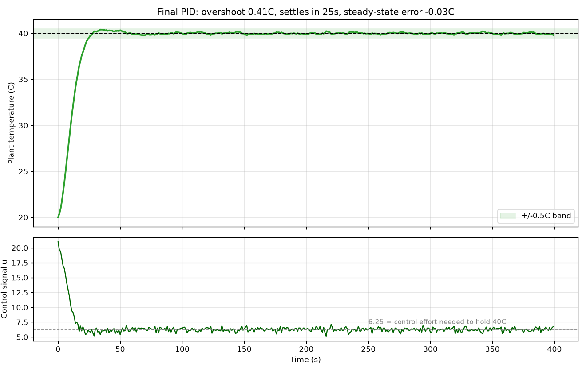
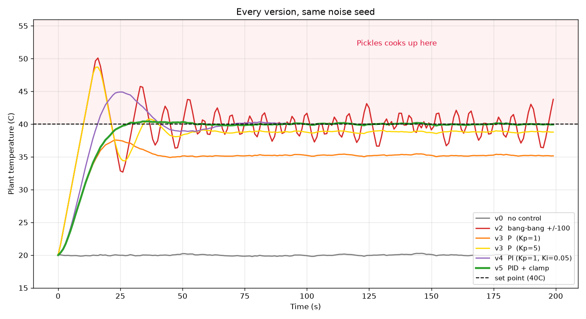
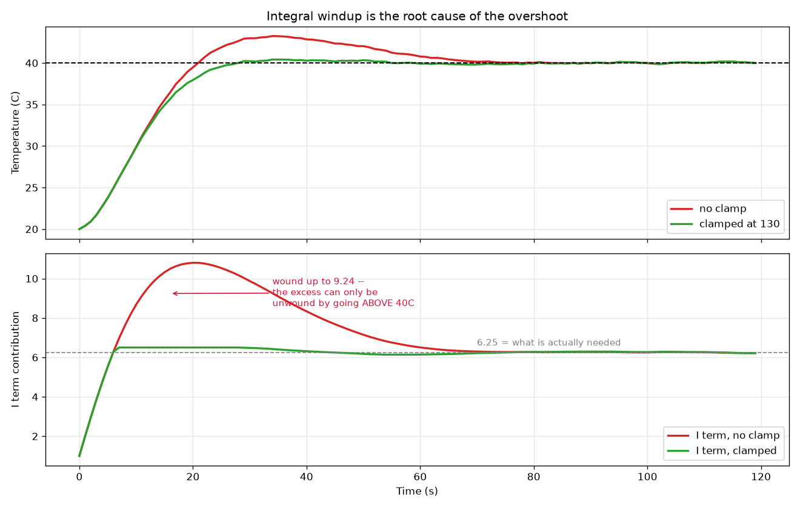
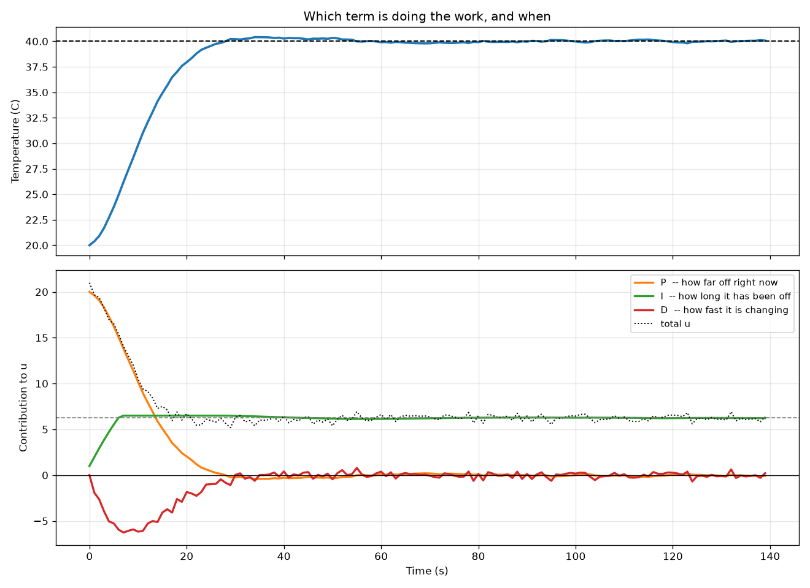

# Temperature Control — SARP-UW Avionics/Payload Interview Project

A PID controller for the "Temperature Control (Hard)" problem: hold a plant
at 40 °C inside a leaky glass box sitting in a 20 °C room, using only a
temperature sensor and a heat pump whose control scaling is unspecified.

**Constraint that drives every design decision:** Pickles the houseplant
survives *only* at 40 °C — not above, not below. So overshoot is not a
cosmetic flaw, it is a mission failure. A controller that reaches 40 °C by
first passing through 48 °C has killed the payload.

---

## Result

| Metric | Value |
|---|---|
| Overshoot | **0.41 °C** |
| Settling time (±0.5 °C) | **25 s** |
| Steady-state error | **+0.02 °C** |
| Steady-state control effort | 6.28 (theory predicts 6.25) |



The residual ±0.3 °C ripple is the plant's own environmental noise
(`random.gauss(0, 0.05)` per step), not controller error — it is the noise
floor measured from the open-loop baseline, so no controller can do better.

---

## The controller

```python
integral = 0.0        # accumulated error, persists across calls
last_error = None     # previous error, for the derivative term


def controller(curr_temp: float, set_point: float) -> float:
    global integral, last_error

    Kp = 1.0          # P: how far off right now
    Ki = 0.05         # I: how long it has been off
    Kd = 5.0          # D: how fast it is changing
    I_MAX = 130.0     # anti-windup clamp

    error = set_point - curr_temp

    integral += error
    integral = max(-I_MAX, min(I_MAX, integral))

    if last_error is None:
        derivative = 0.0
    else:
        derivative = error - last_error
    last_error = error

    return Kp * error + Ki * integral + Kd * derivative
```

Because the supplied main loop runs at a fixed 1 Hz, `dt = 1` and the calculus
collapses into arithmetic: `∫e·dt` becomes a running sum, `de/dt` becomes a
difference. The gains absorb the missing `dt`.

---

## Running it

```bash
pip install matplotlib
python Controller.py      # real-time run with the live plot (1 s per step)
python experiments.py     # every experiment below, offline, in milliseconds
```

`experiments.py` regenerates every figure and every number quoted in this
README.

---

## How it was built

Each version below was kept because the reasoning that led to the next one is
the substance of the project. Every run uses the same fixed RNG seed, so two
controllers face an identical noise sequence and any difference is
attributable to the controller alone.



| Version | Peak | Overshoot | Settle | Steady error | Verdict |
|---|---:|---:|---:|---:|---|
| v0 no control | 20.3 | — | never | −20.02 | plant sits at ambient |
| v1 full power `u=100` | 340.3 | — | never | +299.98 | reproduces the "oven" |
| v2 bang-bang ±100 | 50.1 | 10.09 | never | −0.11 | permanent oscillation |
| v3 P, `Kp=1` | 37.6 | **0.00** | never | **−4.75** | smooth, but never arrives |
| v3 P, `Kp=5` | 48.7 | **8.70** | never | −1.17 | closer, but cooks the plant |
| v4 PI | 44.9 | 4.91 | 63 s | **+0.03** | arrives, overshoots on the way |
| v4b PI + clamp only | 43.0 | 3.03 | 63 s | +0.03 | not enough alone |
| v4c PID, no clamp | 43.2 | 3.24 | 65 s | +0.02 | not enough alone |
| **v5 PID + clamp** | **40.4** | **0.41** | **25 s** | **+0.02** | ✅ |

### v1 → v2: use the sensor

`return 100` ignores both of its arguments. It reproduces exactly the failure
described in the problem statement — the box behaves like an oven, settling at
340 °C. Bang-bang control (`+100` if cold, `-100` if hot) at least reads the
sensor, but it only asks *which direction*, never *by how much*, so it slams
between full heat and full cool forever.

### v2 → v3: scale the effort to the error

`u = Kp · e` eases off as the target approaches. Smooth, no oscillation — and
it never reaches 40 °C. With `Kp = 1` it parks at 35.2 °C.

### v3: why more gain is not the answer

| Kp | 0.5 | 1 | 2 | 5 | 10 | 20 |
|---|---:|---:|---:|---:|---:|---:|
| Steady error | −7.70 | −4.75 | −2.73 | −1.17 | −0.61 | −0.31 |
| Overshoot | 0.00 | 0.00 | 2.08 | 8.70 | 12.00 | 14.00 |

The error shrinks but never reaches zero, while overshoot grows without bound.
Proportional control alone cannot solve this problem — see *Insight 1*.

### v3 → v4: integrate

The integral term accumulates error over time, so it can produce a non-zero
output at zero error. Steady-state error drops from −4.75 °C to +0.03 °C.
But it introduces a 4.91 °C overshoot spike.

### v4 → v5: diagnose the overshoot before treating it

The instinct is to reach for the derivative term. Measured on its own, D only
takes overshoot from 4.91 to 3.24 — because it treats the wrong cause. See
*Insight 2*. The fix that matters is clamping the integrator; the two together
take overshoot to 0.41.



---

## Insight 1 — why P control structurally cannot reach the set point

The box leaks heat continuously, so holding 40 °C requires a *permanent*
non-zero control output. But `u = Kp · e` produces zero output at zero error.
The two requirements are contradictory, and the loop settles wherever they
balance.

Working the plant model backwards gives the number that requirement is worth.
Per 1-second step the plant is:

```
H ← H + 0.20·u − 0.05·(H − 20)          heater
T ← T + 0.08·(H − T) + 0.02·(20 − T)    plant
```

At equilibrium with `T = 40`:

```
0.08·(H − 40) + 0.02·(20 − 40) = 0   →   H = 45
0.20·u − 0.05·(45 − 20)        = 0   →   u = 6.25
```

So the loop needs a standing output of **6.25** forever, and more generally
`T_ss = 20 + 3.2·u`. Substituting `u = Kp·e` gives the steady-state error of a
proportional controller in closed form:

```
e = 20 / (1 + 3.2·Kp)
```

| Kp | predicted | measured |
|---|---:|---:|
| 1 | 4.76 | 4.75 |
| 5 | 1.18 | 1.17 |
| 20 | 0.31 | 0.31 |

Theory and simulation agree to within the noise floor, which cross-validates
both the model reading and the implementation. The formula also shows the
error can only reach zero as `Kp → ∞`, which the overshoot column rules out.

## Insight 2 — the overshoot is integral windup, not momentum

Climbing from 20 °C to 40 °C takes 16 seconds, and the error is positive for
all of them, so the integrator accumulates the whole way. By the moment the
plant first touches 40 °C the integral term is contributing **9.24** — against
the 6.25 actually required.

That surplus can only be discharged by negative error, and negative error
means *the plant is above 40 °C*. The overshoot is therefore not the plant
coasting past the target; it is the integrator paying back what it
over-accumulated. Measured: the I term takes 24 s to unwind from 9.24 back to
6.25, and the plant stays above 40 °C for that entire window.

This is why the derivative term barely helps. D shapes the approach; it cannot
remove accumulated integral state. The clamp does:

```python
integral = max(-I_MAX, min(I_MAX, integral))
```

`I_MAX = 130` is not a tuned number. Steady state needs `Ki · integral = 6.25`,
so `integral = 125`; clamping at 130 caps the integral term's contribution at
6.5 — just above what is required, so the loop still holds 40 °C with no
steady-state error, but it can never wind up far enough to force a large
overshoot.



The figure above shows the division of labour: P dominates the sprint, D brakes
during the approach, and once the plant is on target P and D both fall to
approximately zero while I alone holds the standing 6.25.

---

## Test methodology

The supplied main loop sleeps 1 s per step, so a single 300-step experiment
takes 5 minutes of wall clock. `sim.py` drives the same unmodified `Plant_Box`
with plotting disabled and no sleep, which makes a run take milliseconds and a
parameter sweep practical.

- **Fixed seed.** `Plant_Box` draws its noise from the global `random` module,
  so seeding makes two controllers face an identical disturbance sequence.
- **Quantified, not eyeballed.** Every version is scored on peak, overshoot,
  settling time (first step after which the plant never again leaves ±0.5 °C),
  and steady-state error (mean of the last 50 samples).
- **Noise floor established first.** The open-loop baseline showed ±0.3 °C of
  environmental noise, which is the resolution limit for any "is it settled"
  claim.

`Plant_Box.py` is unmodified.

---

## Known limitations

Honest list of what this controller does not yet handle:

1. **No output saturation.** The controller can request `u = 21` during the
   initial transient. A real heat pump has a finite power limit; once it
   saturates, the true anti-windup fix is back-calculation against the actual
   applied output rather than a fixed integral clamp.
2. **Unfiltered derivative.** `error - last_error` amplifies sensor noise
   directly. It is tolerable at `σ = 0.05` (output jitter σ ≈ 0.31) but scales
   linearly with noise; a real sensor would need a low-pass filter on D, or
   derivative-on-measurement to avoid derivative kick on set-point changes.
3. **`I_MAX` is tied to one operating point.** It was derived for a 40 °C set
   point in a 20 °C room. A different set point or ambient temperature changes
   the required standing output and would need the clamp recomputed — a
   feedforward term would remove that dependency.
4. **No reset.** State lives in module-level globals, so a second run in the
   same process inherits a dirty integrator.
5. **Tuned against one noise seed.** Robustness across seeds and against
   ambient disturbances has not been characterised.

## Possible extensions

- Feedforward on the known ambient loss, so the integrator only has to correct
  the residual instead of discovering 6.25 from scratch.
- Estimating the hidden heater temperature (the state that actually causes the
  lag) instead of inferring it from the plant's derivative.
- Gain scheduling: aggressive gains far from the set point, conservative near
  it.

---

## Files

| File | Role |
|---|---|
| `Controller.py` | The deliverable — the `controller()` function |
| `Plant_Box.py` | Supplied plant model (unmodified) |
| `sim.py` | Offline harness: run, metrics, plotting |
| `experiments.py` | Regenerates every figure and number in this README |
| `figures/` | Generated output |
| `Temperature_Control___Hard.pdf` | Original problem statement |
